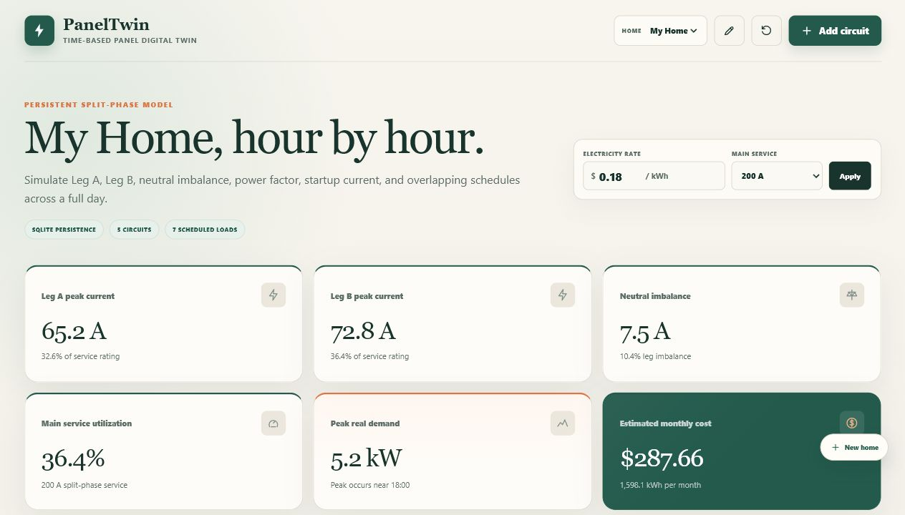
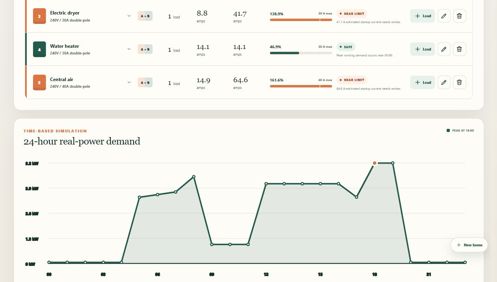

# PanelTwin

PanelTwin is a focused residential electrical panel digital twin built with
React, Vite, FastAPI, and SQLite. This release improves electrical accuracy,
time resolution, scheduling, and input traceability without adding unrelated
production features.

> **Educational use only:** PanelTwin is not a replacement for an NEC-compliant
> load calculation, breaker or conductor selection, field measurement, local
> code review, or engineering work by a qualified professional.





## Live Demo

After this repository is pushed to GitHub and GitHub Pages is enabled with
**Source: GitHub Actions**, the live demo will be available at:

```text
https://YOUR_GITHUB_USERNAME.github.io/YOUR_REPOSITORY_NAME/
```

For example, if the repo is named `PanelTwin`:

```text
https://YOUR_GITHUB_USERNAME.github.io/PanelTwin/
```

The GitHub Pages demo is a read-only static version of the app. It loads a
sample panel from `frontend/public/demo/panel.json` so visitors can explore the
dashboard, split-phase calculations, charts, warnings, and equations without
installing Python, Node.js, or SQLite.

The full editable app still uses the FastAPI backend and SQLite locally.

## Why I Built This

PanelTwin was built as an electrical-engineering and software portfolio project.
The goal is to make residential panel behavior easier to explore: branch-circuit
load, split-phase leg balance, neutral imbalance, inrush events, schedules,
energy use, and cost are all visible in one place.

The project is intentionally scoped as an educational simulator. It favors
transparent equations, editable assumptions, and testable calculations over
pretending to be a licensed electrical design tool.

## What It Demonstrates

- Translating electrical-engineering concepts into a working web application
- Building a full-stack app with a React/Vite frontend and FastAPI backend
- Modeling time-based demand with 15-minute weekday and weekend schedules
- Persisting homes, panel settings, circuits, loads, and schedules in SQLite
- Separating normal running demand from short startup/inrush transients
- Writing backend tests around formulas, edge cases, persistence, and migration
- Documenting model assumptions clearly enough for another developer to audit

## This Release

- Separates normal running current from startup/inrush current
- Models startup as a short transient with a user-defined duration
- Excludes startup transients from main-service utilization
- Uses 15-minute demand intervals instead of one-hour blocks
- Supports multiple weekday and weekend operating periods per load
- Calculates branch load as noncontinuous current plus 125% of continuous
  current
- Separates normal overloads, branch-load advisories, and transient advisories
- Labels load data as `Measured`, `Manufacturer`, or `Estimated`
- Explains equations, inputs, and assumptions throughout the interface
- Migrates existing SQLite data without resetting saved homes

This release intentionally does not add authentication, solar, batteries,
reports, or production deployment features.

## Electrical Model

### Real Power, Apparent Power, and Running Current

```text
S (VA) = P (W) / PF
I_running (A) = S (VA) / V (V)
```

For example, a 2,400W, 240V load at a 0.80 power factor:

```text
S = 2400 / 0.80 = 3000 VA
I_running = 3000 / 240 = 12.5 A
```

### Branch-Circuit Load Calculation

PanelTwin evaluates each 15-minute interval using:

```text
I_calculated = I_noncontinuous + 1.25 x I_continuous
```

The result is compared with the breaker rating:

- `Safe`: running current and calculated branch load do not exceed the rating
- `Advisory`: running current is within the rating, but the calculated branch
  load exceeds it
- `Overloaded`: normal running current exceeds the breaker rating

An exact calculated load equal to the breaker rating is not marked as an
advisory.

The continuous classification is a user input. PanelTwin does not determine
whether equipment meets the code definition of a continuous load.

### Startup and Inrush Current

```text
I_startup = I_running x inrush multiplier
```

Each load also has an inrush duration in seconds. Startup is recorded when an
operating period begins.

Startup events:

- appear in a separate transient advisory section
- do not change the normal circuit status
- do not contribute to 15-minute real-power demand
- do not contribute to main-service utilization

If multiple loads on one circuit start in the same interval, their instantaneous
inrush components are combined. The duration shown for that combined peak is
the shortest overlapping inrush duration.

This is still an estimate. Actual breaker response depends on the time-current
curve, event duration, ambient temperature, prior loading, and equipment
characteristics.

## 15-Minute Scheduling

Each day contains 96 intervals:

```text
24 hours x 4 intervals/hour = 96 intervals
```

Every load can contain multiple periods for:

- weekdays
- weekends

Times must align to 15-minute boundaries. Overnight periods such as `22:00` to
`02:00` wrap across midnight. Equal start and end times represent a full-day
period. Overlapping periods within the same day type are rejected.

During a period, the load is treated as fully on. Minute-by-minute cycling and
thermostatic probability are outside the scope of this release.

## Energy and Cost

PanelTwin uses a 30-day planning month with 22 weekdays and 8 weekend days:

```text
monthly kWh =
  load kW x
  (weekday hours/day x 22 + weekend hours/day x 8)

monthly cost = monthly kWh x electricity rate
```

The estimate excludes rate tiers, time-of-use prices, demand charges, taxes,
fees, weather, and seasonal behavior.

## Split-Phase Calculations

- A 120V circuit is assigned to Leg A or Leg B.
- A 240V circuit contributes equal running current to both legs.
- Main-service utilization uses the greater running-current peak of the two
  legs.
- Startup current is excluded from service utilization.

The simplified neutral estimate includes only simultaneous 120V current:

```text
I_neutral = |I_A_120V - I_B_120V|
```

The leg imbalance shown at the service-peak interval is:

```text
imbalance (%) = |I_A - I_B| / max(I_A, I_B) x 100
```

Harmonics and nonlinear neutral current are not modeled.

## Data Quality

Each load records where its electrical inputs came from:

- `Measured`: based on direct measurement
- `Manufacturer`: based on nameplate or manufacturer documentation
- `Estimated`: based on a generic preset or assumption

The label does not change the calculation. It tells the user how much confidence
to place in its inputs. Appliance presets default to `Estimated`.

## Persistence and Migration

PanelTwin stores homes, panels, circuits, loads, and normalized schedule periods
in SQLite.

The default database is:

```text
backend/paneltwin.db
```

Set another path with:

```powershell
$env:PANELTWIN_DB_PATH = "C:\data\paneltwin.db"
```

On startup, older databases are migrated by:

1. Adding inrush-duration and data-quality columns
2. Creating the `load_periods` table
3. Converting each legacy runtime to the nearest 15-minute period
4. Copying that period to weekday and weekend schedules

Saved homes and circuits are retained.

## Project Structure

```text
PanelTwin/
|-- .github/
|   `-- workflows/
|       `-- ci.yml
|-- backend/
|   |-- app/
|   |   |-- calculations.py
|   |   |-- main.py
|   |   |-- models.py
|   |   `-- store.py
|   |-- tests/
|   |   |-- test_api.py
|   |   `-- test_calculations.py
|   `-- requirements.txt
|-- frontend/
|   |-- public/
|   |   `-- demo/
|   |       |-- panel.json
|   |       `-- presets.json
|   |-- src/
|   |   |-- components/
|   |   |-- api.js
|   |   |-- App.jsx
|   |   `-- styles.css
|   |-- package.json
|   `-- vite.config.js
|-- .env.example
|-- LICENSE
|-- paneltwin-dashboard.png
|-- paneltwin-panel-chart.png
`-- README.md
```

## Requirements

- Python 3.10 or newer
- Node.js 20.19 or newer
- npm

## Run the Backend

From `backend`:

```powershell
python -m venv .venv
.\.venv\Scripts\python.exe -m pip install -r requirements.txt
.\.venv\Scripts\python.exe -m uvicorn app.main:app --reload --port 8000
```

- API: `http://127.0.0.1:8000`
- OpenAPI docs: `http://127.0.0.1:8000/docs`
- Health: `http://127.0.0.1:8000/health`

## Run the Frontend

In another terminal, from `frontend`:

```powershell
npm.cmd install
npm.cmd run dev
```

Open `http://127.0.0.1:5173`.

The Vite proxy defaults to `http://127.0.0.1:8000`. To use another backend:

```powershell
$env:PANELTWIN_API_TARGET = "http://127.0.0.1:8011"
npm.cmd run dev
```

## Test and Build

Backend:

```powershell
cd backend
.\.venv\Scripts\python.exe -m pytest -q
```

The suite covers:

- watts, VA, power factor, and current formulas
- 100% noncontinuous and 125% continuous load treatment
- exact breaker-rating boundaries
- normal overload versus advisory behavior
- startup multiplier and duration
- separation of transients from running demand and service utilization
- simultaneous startup events
- 15-minute boundaries
- multiple, overnight, full-day, weekday, and weekend periods
- overlap and invalid-time validation
- weighted monthly energy and cost
- split-phase leg and neutral calculations
- high-power coincidence detection
- SQLite persistence and legacy migration

Frontend:

```powershell
cd frontend
npm.cmd install
npm.cmd run build
```

GitHub Actions runs both checks on pushes to `main` and on pull requests.

## Publish the Live Demo

1. Push the `outputs` folder contents as the root of a GitHub repository.
2. In GitHub, open **Settings > Pages**.
3. Set **Build and deployment > Source** to **GitHub Actions**.
4. Push to the `main` branch.
5. Open the URL shown by the `Deploy GitHub Pages Demo` workflow.

The Pages workflow builds the frontend with:

```text
VITE_DEMO_MODE=true
VITE_BASE_PATH=/${{ github.event.repository.name }}/
```

That makes the React app load static demo data instead of calling `/api`.

## What I Learned

- A simulator becomes much more believable when it separates steady-state
  current from short startup events.
- The 125% continuous-load treatment belongs in the branch-circuit load
  comparison, not as a vague 80% warning.
- Time resolution matters. Moving from one-hour blocks to 15-minute intervals
  makes peak demand and load coincidence easier to reason about.
- Good engineering software should show its assumptions, not hide them.
- Tests are especially important for projects that combine UI, persistence,
  and formulas, because a small math change can silently affect many screens.

## API Overview

| Method | Endpoint | Purpose |
| --- | --- | --- |
| `GET` | `/health` | Check API and SQLite status |
| `GET/POST` | `/api/homes` | List or create homes |
| `PUT` | `/api/homes/{home_id}` | Edit a home |
| `GET` | `/api/panel?home_id=...` | Get both 96-point demand profiles |
| `PUT` | `/api/panel/settings?home_id=...` | Update rate and service size |
| `GET` | `/api/presets` | Get appliance presets |
| `POST` | `/api/circuits?home_id=...` | Create a circuit |
| `PUT/DELETE` | `/api/circuits/{id}?home_id=...` | Edit or remove a circuit |
| `POST` | `/api/circuits/{id}/loads?home_id=...` | Create a load |
| `PUT/DELETE` | `/api/circuits/{id}/loads/{load_id}?home_id=...` | Edit or remove a load |
| `POST` | `/api/panel/reset` | Restore the sample database |

## Remaining Limitations

- Schedule periods are deterministic and treat loads as fully on.
- Inrush uses a multiplier and duration, not a waveform.
- Breaker trip curves and conductor characteristics are not modeled.
- Harmonics, voltage drop, demand factors, and nonlinear neutral current are
  not modeled.
- The service calculation is a running-demand comparison, not an NEC service
  load calculation.
- Data quality is descriptive and does not create statistical uncertainty
  ranges.

## Future Improvements

- Add optional load cycling models for thermostats, refrigerators, and HVAC.
- Add selectable utility rate plans, including time-of-use pricing.
- Add import/export for saved homes.
- Add optional NEC-style load calculation worksheets as a separate mode.
- Add hardware ingestion later for measured current data from a safe external
  sensor project.

## GitHub Notes

Generated files are intentionally ignored:

- `frontend/node_modules/`
- `frontend/dist/`
- `backend/*.db`
- Python cache and test-cache folders
- local `.env` files

Use `.env.example` as a reference for optional local environment variables.
